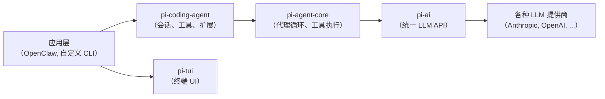
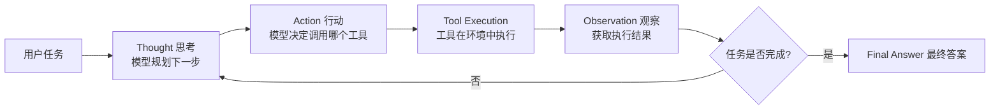

根据网上搜索到的资料，**Pi Coding Agent**（官方包名 `@mariozechner/pi-coding-agent`）是一个开源的、终端界面（CLI）AI 编程助手，其核心是一个极简的 **Agent Loop（代理循环）**，这个循环本质上就是一个 **ReAct Loop**。它由 Mario Zechner（badlogic）开发，作为 pi-mono 工具包的旗舰组件，强调“最小可行性”和“可扩展性”。
下面我将结合搜索到的信息，详细解析 Pi Coding Agent 的 ReAct Loop。
---
### 🧠 一、Pi Coding Agent 概览与设计哲学
在深入其循环之前，了解其整体架构和设计哲学很重要，这有助于理解 ReAct Loop 在其中的位置。
#### 1. 核心定位：极简且可扩展的终端编程代理
Pi Coding Agent 的核心设计哲学是 **“如果你不需要它，它就不会被构建”**。它提供最小可行核心，通过扩展机制让用户按需定制，而不是预先打包所有功能。
#### 2. 技术栈：分层架构
Pi 的技术栈清晰地展现了其 ReAct Loop 的构成：

*   **`pi-ai`**：统一 LLM API 层，负责与各种模型提供商通信，支持工具调用、流式响应、成本追踪等。
*   **`pi-agent-core`**：在 `pi-ai` 之上构建了**代理循环**，负责调用模型、执行工具、将结果反馈给模型，并重复此过程直到任务完成。这是 ReAct Loop 的核心实现层。
*   **`pi-coding-agent`**：基于 `pi-agent-core`，提供了一个生产就绪的编程代理，内置了文件工具、会话持久化、上下文压缩等功能。这是用户主要交互的 CLI 包。
*   **`pi-tui`**：提供终端用户界面库，用于渲染 Markdown、处理编辑器输入等。
#### 3. 核心功能：通过工具与代码世界交互
Pi 的“行动”能力来自其内置工具。它默认提供四个核心工具，正是这些工具构成了其 ReAct Loop 的“行动”部分：
| 工具 | 功能描述 |
| :--- | :--- |
| **`read`** | 读取文件内容（支持图片），输出截断至2000行或50KB，支持分页。 |
| **`write`** | 写入文件，自动创建父目录，覆盖已存在文件。 |
| **`edit`** | 对文件进行精确的文本替换，要求旧文本完全匹配（包括空白字符）。 |
| **`bash`** | 在工作目录执行 Shell 命令，返回 stdout 和 stderr，可设置超时。 |
此外，还有三个可选工具（`grep`, `find`, `list`）以及通过扩展添加自定义工具的能力。
---
### 🔄 二、Pi 的 ReAct Loop：思考-行动-观察的闭环
Pi 的 Agent Loop 是一个经典的 **ReAct Loop** 实现：**模型首先进行思考（Reasoning），然后调用工具（Acting），最后观察工具执行结果（Observation），并基于观察结果进行下一轮思考，如此循环往复，直到任务完成**。
其工作流程可以概括为下图：

#### 1. **Thought（思考）**
模型根据当前会话历史和任务，生成一段“内心独白”，规划下一步行动。例如，当用户要求“重构这个函数使其异步化”时，模型的思考可能是：
> “我需要先读取 `utils.py` 文件来理解当前函数的逻辑，然后检查项目中是否已引入 `aiohttp`，最后才能进行重构。”
#### 2. **Action（行动）**
基于思考，模型选择一个工具并构造参数。例如，在上述思考后，模型可能会调用：
```json
{
  "tool": "read",
  "path": "src/utils.py"
}
```
或者
```json
{
  "tool": "bash",
  "command": "pip list | grep aiohttp"
}
```
在 Pi 的架构中，这一步由 `pi-agent-core` 处理，它负责解析模型的工具调用请求，并调度相应的工具执行。
#### 3. **Observation（观察）**
工具执行后，返回结构化的结果。例如，`read` 工具返回文件内容，`bash` 工具返回命令的输出和退出码。这个结果被注入回会话历史，作为下一轮推理的输入。
#### 4. **迭代循环**
模型拿到观察结果后，更新其对问题的理解，进入下一轮思考。如果代码运行出现错误，模型会根据错误信息进行调试，形成“**试错-反馈-修正**”的闭环。这个过程是 Pi 能够处理复杂多步编程任务的关键。
> 💡 **关键点**：Pi 的 ReAct Loop 是**显式**的。模型的思考（通常以 `<thinking>` 标签包裹）和工具调用（以 JSON 格式呈现）都在用户界面上可见，使得整个推理过程透明、可审计。
---
### 🧪 三、案例演示：一个完整的 ReAct 循环
假设用户对 Pi 说：**“帮我在 `main.py` 中添加一个 `main()` 函数，并运行它。”**
一个典型的 ReAct 循环可能如下进行：
| 步骤 | 阶段 | 内容 |
| :--- | :--- | :--- |
| **1** | **Thought** | “我需要先检查 `main.py` 是否存在，以及它的当前内容。” |
| **2** | **Action** | 调用 `read` 工具，参数为 `"path": "main.py"`。 |
| **3** | **Observation** | 工具返回：`File not found: main.py`。 |
| **4** | **Thought** | “文件不存在。我需要创建它，并写入一个基本的 `main()` 函数。” |
| **5** | **Action** | 调用 `write` 工具，参数为 `"path": "main.py", "content": "def main():\n    print('Hello, World!')\n\nif __name__ == '__main__':\n    main()"`。 |
| **6** | **Observation** | 工具返回：`File written successfully to main.py`。 |
| **7** | **Thought** | “文件已创建。现在我需要运行这个 Python 脚本来验证它是否正常工作。” |
| **8** | **Action** | 调用 `bash` 工具，参数为 `"command": "python main.py"`。 |
| **9** | **Observation** | 工具返回：`Hello, World!`（以及退出码 0）。 |
| **10** | **Final Answer** | “我已经在 `main.py` 中创建了 `main()` 函数，并成功运行。输出如下：`Hello, World!`。” |
这个例子展示了 Pi 如何通过 ReAct Loop 将一个模糊的需求分解为一系列具体的、可验证的步骤。
---
### 🧩 四、扩展性：如何超越核心循环
Pi 的强大之处在于其扩展机制，允许你在其 ReAct Loop 基础上添加新的“行动”能力。
#### 1. **Skills（技能）**
技能是按需加载的能力包，包含指令和工具。例如，你可以安装一个 `skill:testing` 技能，它可能包含编写和运行测试的专用工具，从而丰富模型的行动选项。
#### 2. **Extensions（扩展）**
扩展是用 TypeScript 编写模块，可以添加自定义工具、命令、UI 组件等。例如，你可以编写一个扩展，添加一个 `deploy` 工具，用于将代码部署到远程服务器，并将其纳入 Pi 的 ReAct Loop 中。
#### 3. **工具定制**
`pi-coding-agent` 提供了工具工厂函数，允许你重新创建内置工具，并将其作用范围锁定到特定工作区，实现权限隔离和沙箱执行。这对于多用户环境或生产环境集成至关重要。
---
### ✅ 五、总结：Pi ReAct Loop 的核心优势
结合以上信息，Pi Coding Agent 的 ReAct Loop 具有以下鲜明特点：
1.  **极简核心**：整个代理循环仅418行 TypeScript 代码，系统提示词少于1000个 tokens，但性能却能与 Claude Code、Cursor 等复杂系统比肩。这证明了 **“更少但更好”** 的设计哲学。
2.  **透明可解释**：推理过程和工具调用对用户可见，便于调试、审计和学习。
3.  **自我纠正能力强**：通过观察工具执行结果（尤其是错误信息），模型能够自主迭代修复问题，这是处理编程任务的关键能力。
4.  **高度可扩展**：通过技能、扩展和工具定制机制，你可以轻松将 Pi 改造成适应你自己工作流的专用编程助手，而不是被迫适应它的固定流程。
5.  **会话管理完善**：支持树状会话历史、分支、上下文压缩等功能，使得长程、多轮的复杂任务得以高效管理。
总而言之，Pi Coding Agent 的 ReAct Loop 是一个 **精炼、强大且灵活的代理设计范本**。它不仅展示了如何将 LLM 与工具相结合以解决复杂问题，更重要的是，它提供了将这个核心循环扩展和定制的完整机制，让开发者能够真正“拥有”他们的 AI 编程助手。