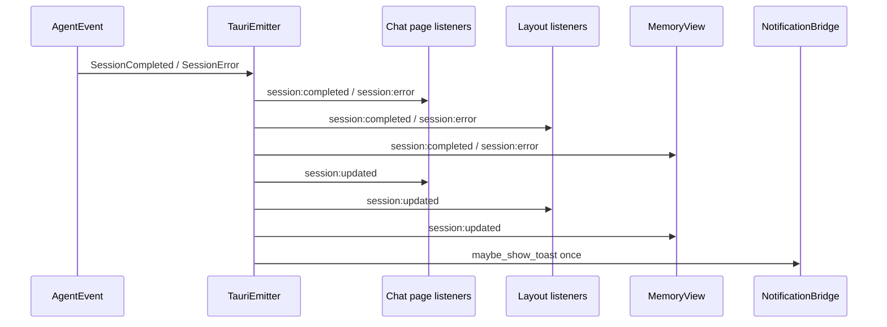

# ADR 0349：Session terminal event cleanup audit

- Status: historical audit; interim implementation superseded by [ADR 0529](0529-single-session-lifecycle-event-and-memory-response-dto.md)
- Scope: `TauriEmitter` terminal fan-out, chat session event handlers, shared session reducer selectors, and lifecycle refresh consumers
- Related: [ADR 0330](0330-session-lifecycle-ui-contract-mapper.md), [ADR 0336](0336-react-session-committed-submission.md), [ADR 0347](0347-agent-event-contract-validation-boundary.md)

## Context

ADR 0347 recorded that `AgentEvent::SessionCompleted` and `AgentEvent::SessionError` are emitted on a primary channel and then projected again as `session:updated`. The chat controller listens to both channels. This audit traces the producer/consumer order and checks whether the overlap can be removed without changing lifecycle semantics.

## Observed event and side-effect flow

For `SessionCompleted` and `SessionError`, `TauriEmitter::emit` runs these steps in order:

1. Cache the terminal status/title and build the primary payload.
2. Emit `session:completed` or `session:error`.
3. Emit a `session:updated` lifecycle payload with `session_id`, terminal status, title, and sanitized reason. `session:error` keeps its error text on the primary channel; the lifecycle projection uses `reason`.
4. Call `NotificationBridge::maybe_show_toast` once for the original Agent event.

The primary and secondary payloads have no shared application event id or sequence. `session_id` is their only common identity. The secondary channel is also emitted independently: for example, ingress recovery can report a terminal status without a primary completion/error event, and status transitions use `SessionUpdated` directly.

The chat page consumes all three channels through `createChatSessionEventHandlers`. The primary completion/error handler records its primary projection (completion reason or error details), clears active ask state, finalizes active live messages, clears previews and stream-block ids, evicts inactive session memory, and schedules a session refresh. The terminal `session:updated` handler projects status/title/reason and performs the same cleanup. `session:error` additionally remembers the error reason; `session:updated` remains the generic status projection used by standalone updates.

The repeated operations are not all equivalent:

- Finalizing messages is value-idempotent when no streaming message remains. Flushing chunks is also a synchronization boundary; a later flush can drain chunks that arrived after an earlier handler.
- Preview removal is a no-op after its session entries are gone. Ask cleanup clears interaction reducer state and separate quick-reply caches. Step-block cleanup and inactive memory eviction dispatch reducer actions again.
- `session/status-updated` maps the sessions array even when the terminal status/title are unchanged, so the sessions selector sees a new reference. `termination-shown` does short-circuit when session/status/reason match.
- Reducer actions that clear interactions, stream blocks, or inactive usage allocate new state maps. The shared root store therefore broadcasts again; sessions/interactions selectors can observe new references even when visible values are unchanged. Per-call usage is projected separately from `agent:usage`; inactive-session eviction clears only its in-memory usage projection, not durable usage. The active-session usage selector is unaffected because eviction skips the active session.
- Completion/error notifications are owned by the primary event: the layout posts one in-app notification, and the Rust notification bridge handles one desktop notification. The secondary terminal update changes model/busy state but does not post a second terminal toast. MemoryView listens to both channels, while its refresh scheduler coalesces the burst.

This is a real repeated cleanup path with some value-idempotent operations and some repeated reducer notifications. The two channel handlers also carry distinct projection responsibilities.

## Decision

- Keep both channels and their producer order because the primary channel and lifecycle projection have distinct consumers. The original audit intentionally deferred cleanup deduplication because no shared occurrence identity existed and `session:updated` also carries standalone terminal transitions.
- Never infer pairing from `session_id`, terminal status, payload equality, arrival adjacency, or Tauri envelope ids. Such matching can suppress an independent transition or a later cleanup needed for newly queued stream output.
- [ADR 0386](0386-session-terminal-occurrence-identity.md) resolves the repeated chat cleanup with an explicit optional `occurrence_id` shared only by a primary terminal event and its secondary `session:updated`. The first of those exact paired projections handled by chat owns cleanup; the other skips it. A standalone `session:updated` remains a cleanup owner.
- Keep the terminal reason/error projections, layout busy/model state, toast owners, MemoryView refresh, channel order, and standalone lifecycle behavior. Reducer lifecycle actions also return the existing state when the requested projection is already equal, avoiding selector notifications for unchanged values.
- No database/session storage, resume interaction normalization, or durable event sequencing changes.

## Verification and rollback

UI tests cover completed/error primary-plus-secondary projection with shared occurrence identity and standalone completed/error `session:updated` cleanup. ADR 0386 adds Rust payload, frontend mapper, and reducer no-op coverage. Run `corepack pnpm run check`, `corepack pnpm run test:run`, `corepack pnpm run build`, `scripts/check-ipc-events.ps1`, and `scripts/check-ipc-contracts.ps1`.

The 2026-09-25 audit itself introduced no wire or persisted-state changes. The additive optional field and its consumers can be reverted together as described in ADR 0386; no database schema, persisted state, or reset changes are involved.
