# ADR 0362：MemoryRuntime 应用边界所有权审计

> 后续决定见 [ADR 0367](0367-memory-runtime-application-ownership.md)：typed construction/readiness handoff 已实现，MemoryStartup、prepare task 与 live consumer 现由 ApplicationRuntime 持有。本文记录原审计及暂缓决定，不再描述当前实现。

- 状态：审计完成；迁移暂缓
- 日期：2026-09-26
- 范围：`MemoryRuntime` 的长期容器所有权、Agent dispatcher readiness barrier 与应用退出边界
- 审查基准：HEAD `0da9ea7`；审查开始时工作区干净
- 关联：[ADR 0263](0263-memory-runtime-agentlayer-startup-barrier.md)、[ADR 0267](0267-memory-runtime-maintenance-schedule.md)、[ADR 0269](0269-memory-worker-shutdown-boundary.md)、[ADR 0299](0299-react-compaction-summary-memory-store-port.md)、[ADR 0312](0312-memory-worker-summary-extraction-state-store.md)、[ADR 0333](0333-tools-runtime-coordinator.md)、[ADR 0336](0336-react-session-committed-submission.md)、[ADR 0361](0361-final-architecture-acceptance-audit.md)

## 背景

原始架构审查提出：`MemoryRuntime` 的长期容器 owner 应位于 `haven-app-binary::ApplicationRuntime` 或明确的 app-owned runtime bundle，`AgentLayer` 只保留 Agent 使用的 `MemoryService` / `MemoryWorker` 和建立 memory recovery readiness 所需的窄边界。审查要求不复制 raw `Database`、`ToolsManager` 或 `MemoryRuntime`，并保持 memory prepare/replay/live consumer、周期与手动维护、worker shutdown 以及 dispatcher readiness 顺序。

当前代码与 ADR 0263 的启动决定一致，但对象所有权分散在两层：

```mermaid
flowchart TD
  subgraph Compose[App composition]
    AppState[AppState::new] --> AgentNew[AgentLayer::new]
    AgentNew --> MemoryService
    AgentNew --> MemoryWorker
    AgentNew --> MemoryRuntime
    Supervisor[SessionSupervisor] --> SessionStore
    MemoryRuntime --> SessionStore
    MemoryRuntime --> MemoryWorker
    AppState --> AppRuntime[ApplicationRuntime]
    AppRuntime --> AgentLayer[AgentLayer]
  end

  subgraph Startup[Startup and recovery barrier]
    Bootstrap[spawn_background_init] --> Start[AgentLayer::start_without_pending_recovery]
    Start --> StartInner[start_inner]
    StartInner --> Prepare[MemoryRuntime::prepare_start]
    Prepare --> Snapshot[subscribe, cursor baseline, outbox restore, durable replay]
    Snapshot --> Prepared[prepared live receiver]
    Prepared --> SpawnConsumer[spawn MemoryRuntime::run_prepared]
    SpawnConsumer --> Consumer[run prepared live consumer]
    Consumer --> Process[process live event, durable enqueue, cursor checkpoint]
    SpawnConsumer --> Dispatcher[then AgentLayer::start_after_memory_ready]
    Dispatcher --> SessionActor[SessionSupervisor dispatcher]
  end

  subgraph Maintenance[Maintenance paths]
    Scheduler[ApplicationRuntime registered task] --> AgentSchedule[AgentLayer schedule facade]
    AgentSchedule --> MemorySchedule[MemoryRuntime six-hour interval]
    MemorySchedule --> WorkerPass[MemoryWorker maintenance pass]
    Manual[run_memory_maintenance command] --> AgentManual[AgentLayer single-pass facade]
    AgentManual --> WorkerPass
  end

  subgraph Shutdown[Shutdown]
    ShutdownCall[ApplicationRuntime::shutdown] --> Cancel[root token cancel]
    Cancel --> WorkerStop[AgentLayer shutdowns MemoryWorker]
    WorkerStop --> Ordered[stop input, quiesce sessions, close actions and MCP]
    Ordered --> Join[join registered app tasks]
    Cancel -. shared token .-> Detached[detached startup and live consumer]
  end
```

| 路径 | 当前 owner / 顺序 | 代码证据 |
|---|---|---|
| 构造 | `AgentLayer::new` 创建 `MemoryService`、`MemoryWorker` 和唯一 `MemoryRuntime`；runtime 复用 `SessionSupervisor::session_store()` 与同一个 worker，并作为 `AgentLayer` 字段长期持有。 | `crates/agent/src/layer.rs`：`AgentLayer::new`、`memory_runtime` 字段 |
| startup prepare / replay | `start` 与 `start_without_pending_recovery` 汇入 `start_inner`。它先 await `MemoryRuntime::prepare_start`；准备成功后启动 `run_prepared`，再调用 `start_after_memory_ready` 开 dispatcher。失败时 dispatcher 不启动，取消时退出。 | `crates/agent/src/layer.rs`：`start_inner`、`start_after_memory_ready`；`crates/agent/src/memory_runtime.rs`：`prepare_start`、`run_prepared` |
| prepare 内容 | `prepare_start` 先订阅 durable session event，再取得 startup session snapshot、补缺失 cursor、恢复 durable extraction outbox 并回放 visible sessions，最后把 live receiver 交给 consumer。 | `crates/agent/src/memory_runtime.rs`：`prepare_start`、`recover_visible_sessions` |
| live consumer | `run_prepared` 消费启动时保存的 receiver，并对 lagged/失败路径执行 durable replay recovery。公开的 `run_until_cancelled` 自己重新 prepare，不能作为“prepare 后再交给 app 启动 dispatcher”的组合 API。 | `crates/agent/src/memory_runtime.rs`：`run_until_cancelled`、`run_prepared` |
| 周期维护 | `ApplicationRuntime` 注册 app-scoped maintenance task，持有 cancellation/join handle；task 经 `AgentLayer::run_memory_maintenance_until_cancelled` 转交给 `MemoryRuntime` 的六小时 schedule，首次 tick 立即执行。 | `crates/app-binary/src/app_state.rs`：`memory-maintenance` task；`crates/app-binary/src/runtime.rs`：task registry/shutdown；`crates/agent/src/layer.rs`：维护 facade；`crates/agent/src/memory_runtime.rs`：interval |
| 手动维护 | `run_memory_maintenance` Tauri command 调用 `AgentLayer::run_memory_maintenance`，执行单次 `MemoryWorker` maintenance pass。 | `crates/app-binary/src/commands/memory.rs`；`crates/agent/src/layer.rs` |
| shutdown | `ApplicationRuntime::shutdown` 先取消 app root token，再由 AgentLayer 显式 shutdown `MemoryWorker`，之后停止 input、quiesce sessions、关闭 actions/MCP，最后 join 已注册 app tasks。周期 maintenance task 已注册并 join；`AgentLayer::start_inner` 与其中的 `run_prepared` 使用嵌套 `tokio::spawn`，只接收同一 cancellation token，不在 ApplicationRuntime task registry 中 join。outbox durable marker 保留供下次恢复。 | `crates/app-binary/src/runtime.rs`；`crates/agent/src/layer.rs`；`crates/agent/src/memory_worker.rs` |

现有 readiness 回归 `both_dispatcher_start_modes_wait_for_memory_runtime_readiness` 覆盖两个 dispatcher start mode：注入 cursor 写入失败时 session 保持 Pending，准备恢复成功后才被 dispatcher 领取。MemoryRuntime 测试另覆盖 cursor baseline/replay、outbox restore、event gap recovery、checkpoint 失败与取消；`shutdown_cancels_worker_and_prompt_prefetch_tokens` 覆盖 MemoryWorker shutdown；`runtime_shutdown_cancels_owned_tasks_and_is_idempotent` 覆盖 ApplicationRuntime task cancel/join 与幂等 shutdown。

## 审计决定

本切片不改代码，暂缓将 runtime 对象从 `AgentLayer` 搬到 `ApplicationRuntime`。当前唯一能保证 recovery barrier 的入口是 `AgentLayer::start_inner`，而 `MemoryRuntime::run_prepared` 为 `pub(crate)`。app-binary 虽可调用公开的 `prepare_start`，但无法启动对应 prepared receiver 的 live consumer，也没有可在 barrier 成功后调用的 Agent dispatcher-only 入口。公开的 `run_until_cancelled` 会再次自行 prepare，不能单独报告 readiness。

构造边界也需要一起设计：`AgentLayer::new` 当前在 crate 内创建 `MemoryService` 和 `MemoryWorker`，且只返回 `AgentLayer`。若让 app 成为 runtime 对象 owner，需要一个把唯一 runtime 从 Agent 组合过程交给 app 的 typed 构造结果，以及一个在 prepare 成功后开放 dispatcher 的 typed readiness 交接。直接把 `Arc<MemoryRuntime>` 加到 Agent start 参数会让 Agent 的 detached startup/live task 长期持有 runtime，不能满足“AgentLayer 只接收窄 readiness port”的目标；把 `run_prepared` 和 dispatcher-only start 开成 app 可调用的公共方法，则会新增跨 crate runtime lifecycle facade，并改变现有 start 调用契约。

因此本轮不删除字段、不复制 runtime、worker、database 或 tools manager，也不把维护调度或关闭顺序改到新的 owner。ADR 0263 的 barrier、ADR 0267 的周期策略与 ADR 0269 的 worker shutdown 语义继续有效；这次审计只标记其对象容器 owner 与 app lifecycle owner 尚未合一。

## 后续最小步骤

1. 先定义 Agent 构造的 typed output，使应用组合根取得唯一 `MemoryRuntime`，同时 `AgentLayer` 继续共享同一 `MemoryService` / `MemoryWorker`；不暴露 raw `Database` 或 `ToolsManager`。
2. 定义可证明 `prepare_start` 成功的窄 readiness handoff。由 app-owned runtime 执行 prepare/replay 和 live consumer，由 Agent 在接收到该 typed readiness 后开放 dispatcher；普通 start 与 cold start 仍选择原有 pending-session recovery 模式。
3. 把周期维护、手动 command 和 `MemoryWorker::shutdown` 接到新容器时，保持当前 cancellation 与 app-task join 顺序；单独审定目前 detached 的 startup/live consumer task handle 是否进入 app task registry，不能在迁移中意外改变其取消或 join 行为，再一并更新 shutdown 测试。
4. 同步更新 ADR 0263/0267 的适用边界、architecture 与 roadmap，并保留 readiness、replay/outbox、manual maintenance 和 shutdown 回归矩阵。完成该设计后再做一个完整 Rust 迁移切片。

不涉及 X12、event replay/outbox 持久化、ID、DB、wire、IPC 或 lifecycle policy 的重新决定；无数据重置要求。
