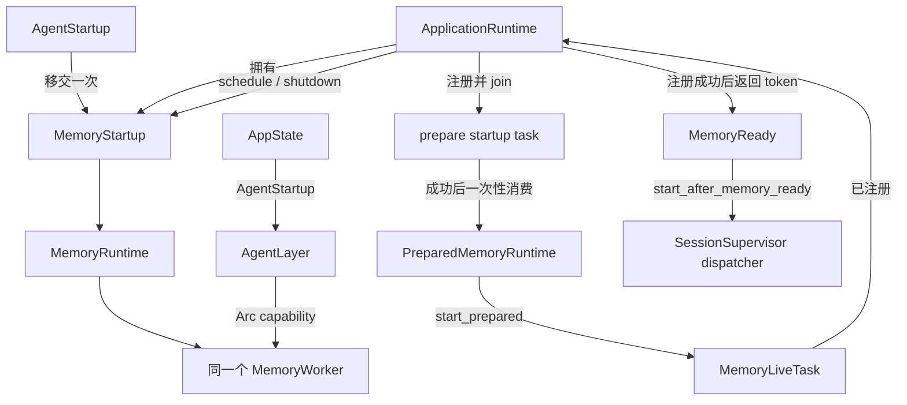

# ADR 0367：MemoryRuntime 所有权与 readiness handoff 移至应用边界

> 其中 `MemoryLiveTask` / `start_prepared` / `register_with` 的命名已由 [ADR 0636](0636-name-memory-live-consumer-handoff.md) 更新；所有权与 readiness 决策保持有效。

- 状态：已采纳（2026-09-26）
- 范围：`AgentLayer`、`MemoryStartup` 与 `ApplicationRuntime` 的内存运行时构造、启动、maintenance 和 shutdown wiring
- 基线：HEAD `384e119`；开始时工作区干净
- 关联：[ADR 0262](0262-memory-runtime-ordered-trigger-processing.md)、[ADR 0263](0263-memory-runtime-agentlayer-startup-barrier.md)、[ADR 0267](0267-memory-runtime-maintenance-schedule.md)、[ADR 0269](0269-memory-worker-shutdown-boundary.md)、[ADR 0299](0299-react-compaction-summary-memory-store-port.md)、[ADR 0312](0312-memory-worker-summary-extraction-state-store.md)、[ADR 0362](0362-memory-runtime-app-ownership-audit.md)、[ADR 0364](0364-agent-layer-memory-service-constructor.md)

## 背景与依赖图

ADR 0362 确认 `AgentLayer::start_inner` 是唯一同时保证 durable memory prepare/replay、live consumer 启动和 dispatcher readiness 顺序的入口。`AgentLayer` 长期持有 `MemoryRuntime`，而 `ApplicationRuntime` 只注册周期 maintenance task；startup 与 live consumer 使用 Agent 内部的 detached `tokio::spawn`，退出时不能由应用统一 join。

本次采用显式构造结果与单次 handoff：



`AgentLayer::build` 返回命名的 `AgentStartup { agent, memory_startup }`。`AgentLayer` 只保存 ReAct/maintenance 所需的同一个 `Arc<MemoryWorker>`；应用取得唯一 `MemoryStartup` 并由 `ApplicationRuntime` 长期保存。`MemoryStartup` 是窄 lifecycle boundary，内部 `MemoryRuntime` 不再从 crate root 暴露为 service locator。

## 决定

1. **唯一 runtime 所有权。** `AgentStartup` 将唯一 `MemoryStartup` 从 Agent 构造交给 AppState；`ApplicationRuntime` 持有该对象。AgentLayer 删除 `memory_runtime` 字段，不在 start path 中构造或保留它。内层 `Arc` clone 只供同一个 app-owned 对象的 registered task 使用，不创建第二个 runtime、worker、service、cache 或 database。
2. **typed prepare handoff。** `MemoryStartup::prepare_start` 只有在订阅 live stream、建立缺失 cursor baseline、恢复 durable outbox 并完成 visible replay 后才返回非 Clone 的 `PreparedMemoryRuntime`。接收者不可访问或复制其 receiver；`start_prepared` 按值消费它并构造 `MemoryLiveTask`。
3. **typed readiness。** `MemoryLiveTask::register_with` 把 live future 交给 task registry，且仅在注册成功时返回不可构造的 `MemoryReady`。`AgentLayer::start_after_memory_ready` 只接收此 token 与命名 `PendingSessionRecovery` enum；旧 `start`、布尔模式参数和会在内部准备 runtime 的兼容入口全部删除。ApplicationRuntime 注册 live consumer 后才调用 Agent dispatcher entry。
4. **失败与取消仍 fail-closed。** prepare/replay 继续在内存 runtime 内以原有可取消退避重试。错误或取消不产生 `PreparedMemoryRuntime` / `MemoryReady`，也不启动 dispatcher；取消仍不推进 memory cursor 或清除 durable outbox marker。
5. **maintenance 与 worker。** `MemoryStartup` 提供周期 schedule 与显式 worker shutdown；ApplicationRuntime 注册并 join maintenance task。`run_memory_maintenance` Tauri command 继续调用 `AgentLayer::run_memory_maintenance`，使用同一个 Worker 执行单次 pass。MemoryRuntime、AgentLayer 和 ReActEngine 共享同一个 worker Arc。
6. **shutdown 顺序。** ApplicationRuntime 先 cancel 根 token，再经 `MemoryStartup` shutdown Worker；随后仍停止 input、quiesce sessions、关闭 actions/MCP，最后 join task registry。prepare startup 与 live consumer 现都在 registry 中，live task join 等待仍位于原来的末尾阶段；周期任务继续先被取消、最后 join。Durable outbox marker 保持下次启动恢复权威。

不改 session dispatcher recovery policy：桌面仍先启动 fresh-session dispatcher，MCP/Skills catalog 完成或超时后才 reload 旧 Pending sessions。也不改 DB、ID、X12、事件 replay/outbox、IPC、wire、Settings 或完整 Job lifecycle。

## 验证

新增或更新的回归覆盖：

- 两种 dispatcher recovery mode 都在 prepare persistence failure 时保持 Pending，恢复后才继续；
- prepare cancellation 退出且 dispatcher 不启动；
- typed PreparedMemoryRuntime 仅一次消费，并且注册 live task 后才取得 readiness；
- AppState/ApplicationRuntime 成功准备 cursor、注册 live consumer，shutdown 后 task registry 为空；
- 单次 Agent memory maintenance 入口保持可用；现有 MemoryWorker shutdown/outbox 与 MemoryRuntime replay 测试继续覆盖 worker shutdown 和 durable recovery。

验收命令：

```text
cargo fmt --all -- --check
cargo test --workspace --locked
cargo check --workspace --locked
cargo clippy --workspace --locked -- -D warnings
```

UI 未修改，不运行 UI 门禁。无数据库、配置、wire 或用户数据变化，不需要重置。

## 替代方案

- 让 AgentLayer 返回 `Arc<MemoryRuntime>` 并由 Agent 启动 detached task：Agent 仍会长期持有 runtime，拒绝。
- 公开 raw broadcast receiver、`run_prepared` runtime facade 或 boolean readiness：接收者可被丢弃/重复使用，调用端也能无证明地开启 dispatcher，拒绝。
- 在 app 直接重建 Worker/Runtime：会重复 inference port 或 Worker，并可能复制 outbox/cache owner，拒绝。
- 让启动 task 等待完整 prepare 后才返回给 app-bootstrap：会串行延迟 MCP/Skills discovery；继续在并行的 app-owned startup task 中运行，保持冷启动顺序。

## 回滚

回滚代码、app wiring、startup 回归、architecture、roadmap 与本 ADR，可恢复 AgentLayer 持有 MemoryRuntime 的实现。无 schema、数据、配置或 IPC 回滚步骤；回滚后 startup/live consumer task 会重新成为 Agent 内部 detached task。
